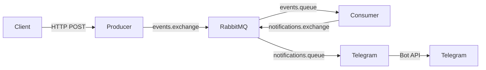

# Микросервисы Nest.js + RabbitMQ + Telegram

Monorepo на [Turborepo](https://turbo.build/) и [Bun](https://bun.sh/) с тремя Nest.js-сервисами и общим пакетом типов.

## Архитектура



| Сервис | Порт | Назначение |
|--------|------|------------|
| **producer** | 3001 | REST API, публикация событий (UUID, JSON, publisher confirm, ретраи) |
| **consumer** | 3002 | Обработка событий (manual ack, DLX-ретраи, идемпотентность) |
| **telegram** | 3003 | Отправка уведомлений в Telegram из очереди |

## Требования

- [Bun](https://bun.sh/) ≥ 1.1 (`curl -fsSL https://bun.sh/install | bash` или `powershell -c "irm bun.sh/install.ps1 | iex"`)

## Быстрый старт

### Локально

```bash
cp .env.example .env
# Укажите TELEGRAM_BOT_TOKEN и TELEGRAM_CHAT_ID

bun install
bun run build
docker compose up -d rabbitmq
bun run dev
```

### Docker (все сервисы)

```bash
cp .env.example .env
docker compose up --build
```

## API (Swagger)

- Producer: http://localhost:3001/docs
- Consumer: http://localhost:3002/docs
- Telegram: http://localhost:3003/docs

### Пример: отправить событие

```bash
curl -X POST http://localhost:3001/api/v1/events \
  -H "Content-Type: application/json" \
  -d '{"type":"order.created","payload":{"orderId":42,"amount":99.5}}'
```

С тем же `id` повторный запрос на producer создаст новое сообщение; идемпотентность обеспечивается на **consumer** (дубликаты по `eventId` пропускаются).

### Тест сбоя и ретрая

```bash
curl -X POST http://localhost:3001/api/v1/events \
  -H "Content-Type: application/json" \
  -d '{"type":"simulate.failure","payload":{}}'
```

Сообщение уйдёт в retry-очередь (TTL 5 с) и вернётся в основную очередь до лимита `RABBITMQ_CONSUMER_MAX_RETRIES`, затем — в DLQ.

## RabbitMQ Management

http://localhost:15672 (guest / guest)

Очереди: `events.queue`, `events.retry`, `events.dlq`, `notifications.queue`

## Линтинг и форматирование (Biome)

```bash
bun run lint          # проверка (lint + format + imports)
bun run lint:fix      # автоисправление
bun run format        # только форматирование
bun run ci            # режим CI (без записи на диск)
```

Рекомендуется расширение [Biome](https://biomejs.dev/guides/editors/first-party-extensions/) для VS Code / Cursor.

## Тесты

```bash
bun run test
bun run test:e2e
```

## Структура (чистая архитектура)

```
apps/{producer,consumer,telegram}/src/
  domain/ports/       # интерфейсы (DIP)
  application/        # use-cases
  infrastructure/     # RabbitMQ, Telegram API
  presentation/       # controllers, DTO
packages/shared/      # контракты сообщений и константы RabbitMQ
```

## Переменные окружения

См. [.env.example](.env.example).
